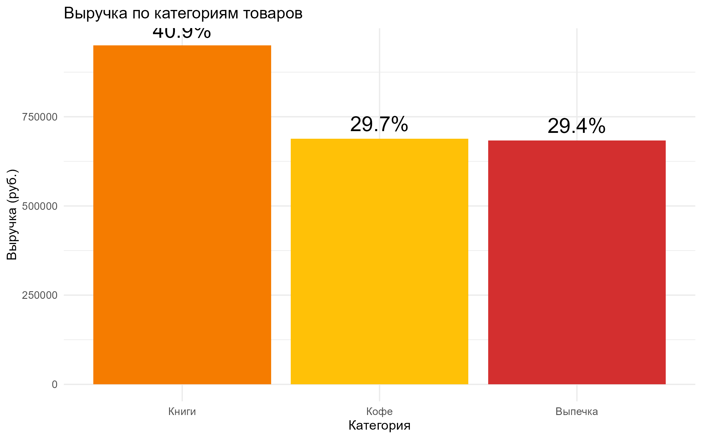
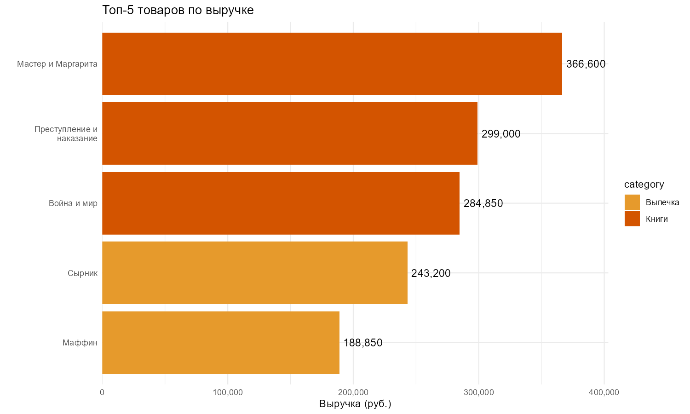
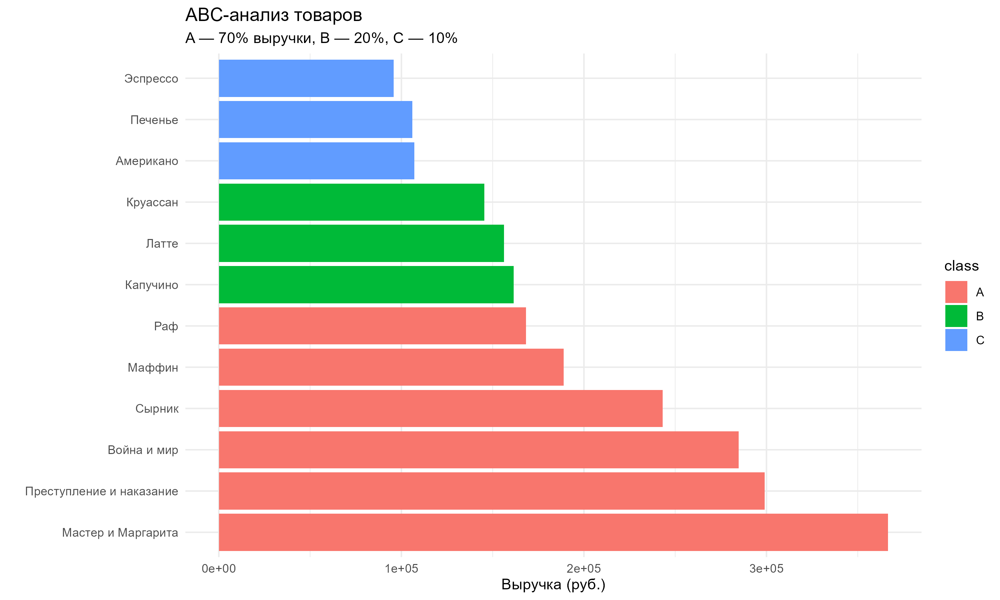
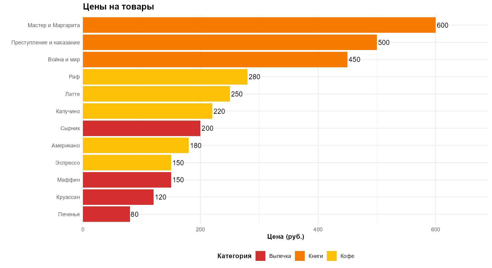

```{r setup, include=FALSE}
# Настройка отчёта
knitr::opts_chunk$set(echo = FALSE, warning = FALSE, message = FALSE)

# Библиотеки
library(tidyverse)
library(knitr)
library(scales)

# Данные
metrics_A <- readRDS("outputs/metrics_A.rds")
metrics_B <- readRDS("outputs/metrics_B.rds")
sales <- read.csv("data/sales.csv")
```

# 1. Общая статистика

```{r general-stats}
total_revenue <- sum(metrics_A$revenue_by_category$revenue)
total_transactions <- n_distinct(sales$transaction_id)
avg_check <- total_revenue / total_transactions
total_items <- sum(sales$quantity)
```

| Показатель | Значение |
|------------|----------|
| **Общая выручка** | `r comma(total_revenue)` руб. |
| **Всего транзакций** | `r comma(total_transactions)` |
| **Средний чек** | `r round(avg_check, 2)` руб. |
| **Всего продано товаров** | `r comma(total_items)` шт. |

---

# 2. Товарный анализ

## 2.1 Выручка по категориям

```{r category-revenue}
metrics_A$revenue_by_category %>%
  mutate(
    `Выручка (руб.)` = scales::comma(revenue),
    `Доля (%)` = scales::percent(share / 100, accuracy = 0.1)
  ) %>%
  select(Категория = category, `Выручка (руб.)`, `Доля (%)`) %>%
  kable(caption = "Выручка по категориям товаров")
      col.names = c("Категория", "Выручка (руб.)", "Доля (%)")
```



**Вывод:** Основную выручку приносит категория **`r metrics_A$revenue_by_category$category[1]`** — `r metrics_A$revenue_by_category$share[1]`% от общей выручки.

## 2.2 Топ-5 товаров по выручке

```{r top-products}
kable(metrics_A$top_products,
      caption = "Топ-5 товаров по выручке",
      col.names = c("Товар", "Категория", "Выручка (руб.)"))
```



**Вывод:** Топ-3 товара: `r paste(metrics_A$top_products$product[1:3], collapse = ", ")`.

## 2.3 ABC-анализ

```{r abc}
abc_table <- metrics_A$abc %>%
  group_by(class) %>%
  summarise(
    Товаров = n(),
    Выручка = sum(revenue),
    Доля = round(sum(revenue) / total_revenue * 100, 1)
  )
names(abc_table)[names(abc_table) == "class"] <- "Класс ABC"
kable(abc_table, caption = "ABC-анализ товаров")
```



**Вывод:** `r abc_table$Товаров[abc_table$class == "A"]` товаров дают 70% выручки, `r abc_table$Товаров[abc_table$class == "C"]` товаров — всего 10%.

## 2.4 Цены на товары



## 2.5 Выводы студента А

```{r insights-a, comment=""}
if(file.exists("outputs/insights_A.txt")) {
  cat(readLines("outputs/insights_A.txt"), sep = "\n")
} else {
  cat("⚠️ Выводы не найдены")
}
```

---


# 3. Временной анализ
=======

## 3.1 Выручка по дням недели

```{r weekday-revenue}
kable(metrics_B$sales_by_weekday,
      caption = "Выручка по дням недели")
```


**Вывод:** Пик продаж — **`r metrics_B$sales_by_weekday$weekday[which.max(metrics_B$sales_by_weekday$revenue)]`**.

## 3.2 Средний чек по дням недели


## 3.3 Будни vs выходные

```{r weekend-vs-weekday}
kable(metrics_B$weekday_vs_weekend,
      caption = "Будни против выходных")
```


## 3.4 Динамика продаж


## 3.5 Выводы студента Б

```{r insights-b, comment=""}
if(file.exists("outputs/insights_B.txt")) {
  cat(readLines("outputs/insights_B.txt"), sep = "\n")
} else {
  cat("⚠️ Выводы не найдены")
}
```

---

# 4. Общие рекомендации

### Ассортиментная стратегия
- Укрепить категорию **`r metrics_A$revenue_by_category$category[1]`**
- Провести распродажу товаров категории C

### Временная стратегия
- Увеличить запасы к пятнице и субботе
- Запустить акцию "Счастливый вторник"

### Маркетинговые активности
1. По вторникам — скидки
2. В выходные — премиум-меню
3. Для топ-товаров — отдельная витрина

---

# 5. Заключение

| Студент | Задачи | Графиков | Выводов |
|---------|--------|----------|---------|
| **А** | Товарный анализ | 4 | 4 |
| **Б** | Временной анализ | 4 | 4 |

**Дата защиты:** `r Sys.Date()`

---