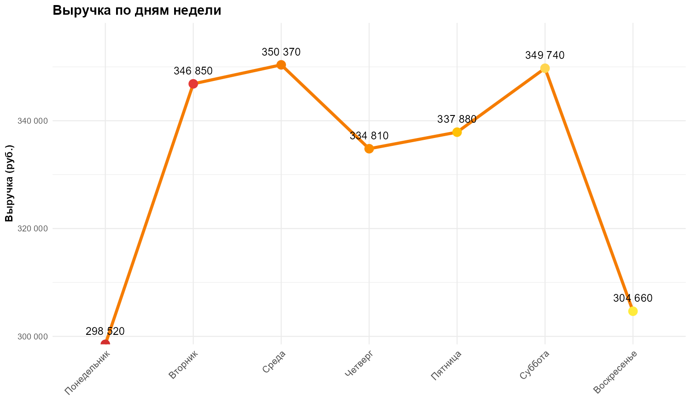
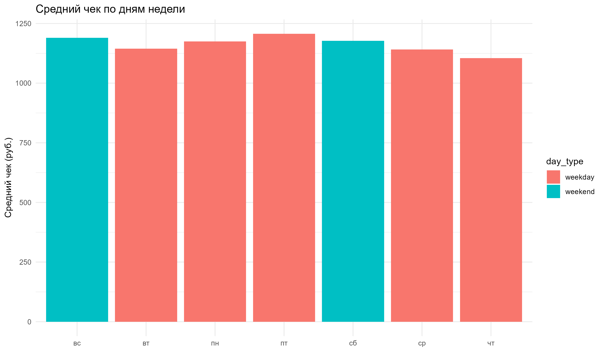
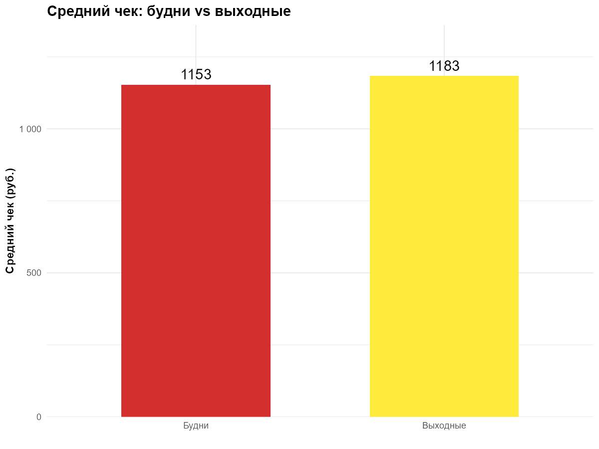
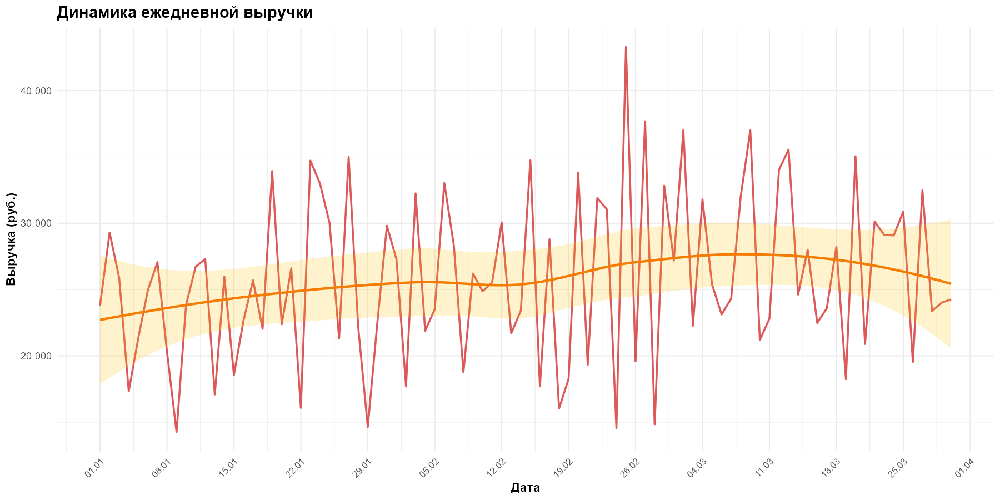

```{r setup, include=FALSE}
knitr::opts_chunk$set(echo = FALSE, warning = FALSE, message = FALSE)
library(tidyverse)
library(knitr)
library(scales)

metrics_A <- readRDS("outputs/metrics_A.rds")
metrics_B <- readRDS("outputs/metrics_B.rds")
sales <- read.csv("data/sales.csv")
```

# 1. Общая статистика

```{r general-stats}
total_revenue <- sum(metrics_A$revenue_by_category$revenue)
total_transactions <- n_distinct(sales$transaction_id)
avg_check <- total_revenue / total_transactions
total_items <- sum(sales$quantity)
```

| Показатель | Значение |
|------------|----------|
| **Общая выручка** | `r scales::comma(total_revenue)` руб. |
| **Всего транзакций** | `r scales::comma(total_transactions)` |
| **Средний чек** | `r round(avg_check, 2)` руб. |
| **Всего продано товаров** | `r scales::comma(total_items)` шт. |

---

# 2. Товарный анализ (Студент А)

## 2.1 Выручка по категориям

```{r category-revenue}
kable(metrics_A$revenue_by_category,
      caption = "Выручка по категориям товаров",
      col.names = c("Категория", "Выручка (руб.)", "Доля (%)"))
```

## 2.2 Топ-5 товаров по выручке

```{r top-products}
kable(metrics_A$top_products,
      caption = "Топ-5 товаров по выручке",
      col.names = c("Товар", "Категория", "Выручка (руб.)"))
```
## 3. Временной анализ (Студент Б)

### 3.1 Выручка по дням недели


### 3.2 Средний чек по дням недели


### 3.3 Сравнение будней и выходных


### 3.4 Динамика продаж


### 3.5 Выводы по временному анализу

```{r, echo=FALSE}
cat(readLines("outputs/insights_B.txt"), sep = "\n")
```